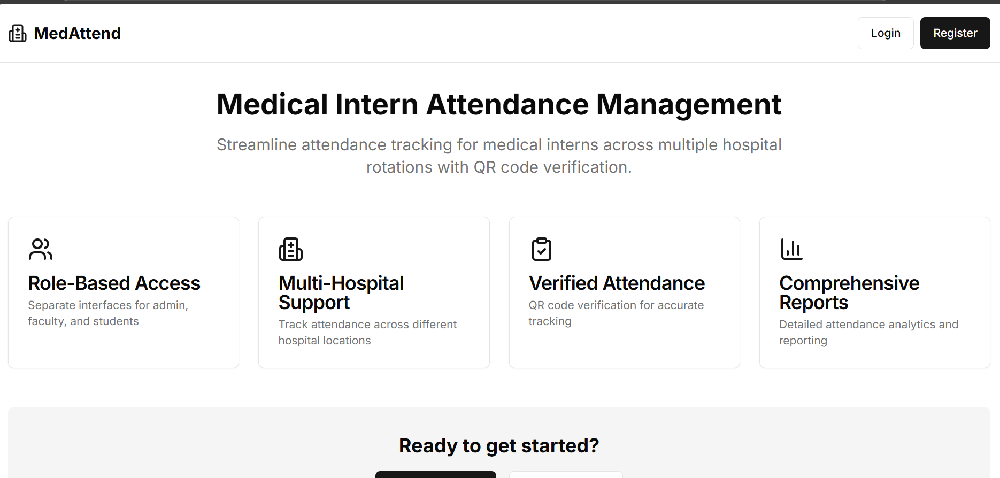
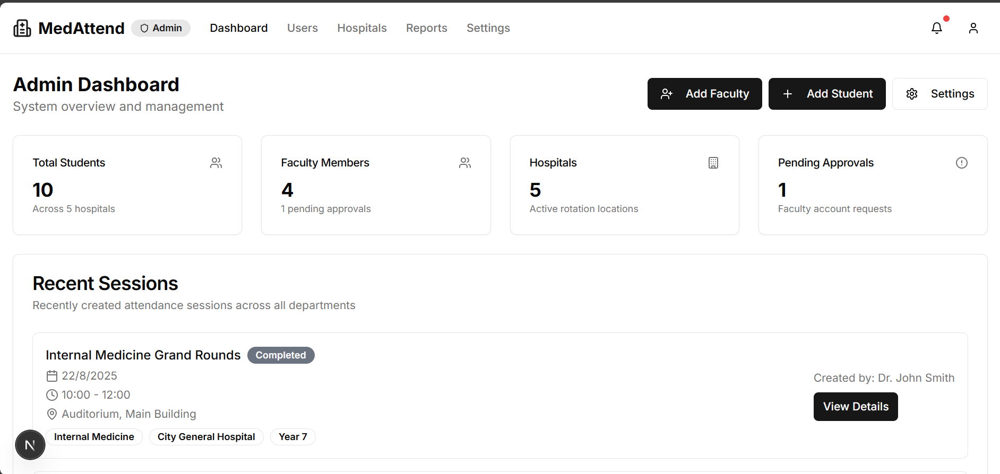
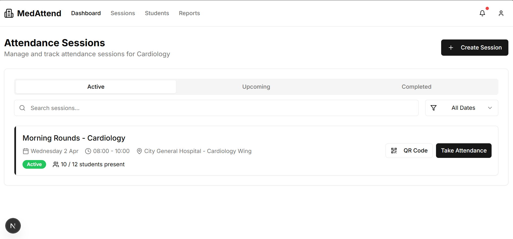
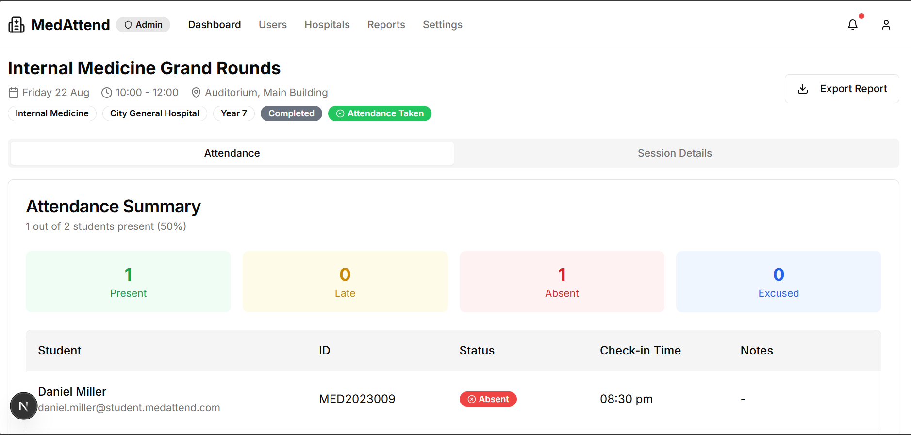
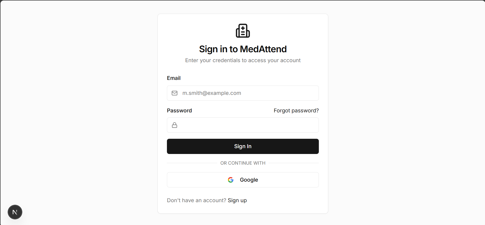

A web application for medical college interns to mark attendance during hospital visits with faculty. The system simplifies attendance tracking using Geolocation & QR code scanning, ensuring accuracy and reliability.

Features

 Admin:
Manage students & faculty with class & department categorization.
View & export attendance records.

 Faculty:
Create attendance sessions for hospital visits.
Mark attendance using QR codes & Geolocation tracking.
View & verify attendance records.

 Students:
Mark attendance via QR code/GPS.
View personal attendance history by class & department.
Receive attendance reminders.

Core Functionalities
Class & Department-wise Student Management

Role-Based Authentication (Firebase: Email)

Offline Attendance Syncing
Real-time Notifications
Exportable Attendance Reports

